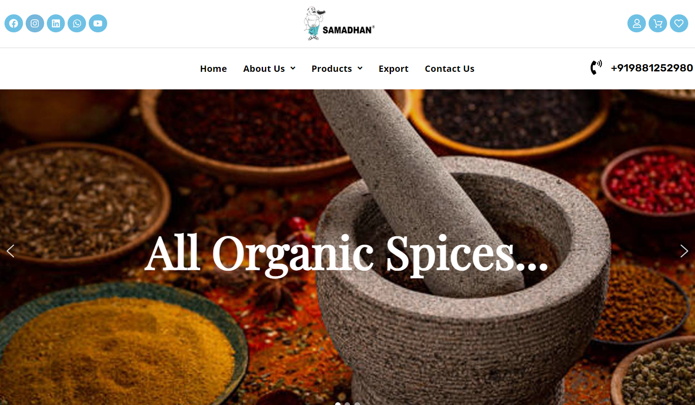

# Vijaya-Foods

**Client:** Smt. Shilpa Rajeev Huzurbazar  
**Website:** vijaayafoods.com  
**Tech Stack:** PHP, MySQL, WordPress, WooCommerce, Elementor, Astra  Theme, Payment Gateway Integration  

### 🏢 About the Brand

**Vijaya Foods** is a tradition-bound Indian company with deep roots in tradition, renowned for its excellence in production, distribution, and export of a vast variety of spices under its own proprietary brand name. The products of the company comprise whole spices, ground spices, blended spice mixes, and nutraceutical spice formulations—each one embodying the rich culinary tradition of India.

### 🎯 Project Objective

To create an easy-to-use, visually stunning, and completely functional e-commerce website that embodies the authenticity of Vijaya Foods, allowing customers to easily navigate, buy, and experience the brand's high-quality spice products online.

### 🚧 Challenges

- UX Design Overhaul
	Even though the brand had a rich heritage and excellent products, its online presence did not have an easy-to-use user experience and contemporary design aspects. The prime challenge was designing a UX that conveys trust, simplifies usability, and aids in smooth e-commerce interactions.

### 💡 Our Approach  

- Discovery & Research
	- Performed brand and market research in order to grasp the traditional roots and consumer expectations.
	- Compared competitors operating in the spice and organic products industry.

- UX & UI Design
	- Created a clean, natural, and culturally relevant UI with Elementor and Astra Theme.
	- Streamlined navigation for simplicity of use across demographics and age groups.
	- Confirmed mobile responsiveness and accessibility across devices.

- Development
	- Based on WordPress with WooCommerce for solid e-commerce functionality.
	- Implemented a secure and scalable Payment Gateway to facilitate seamless transactions.
	- Tailored product pages with detailed spice descriptions, health benefits, and use cases to facilitate well-informed purchases.

- Performance Optimization
	- Improved website speed and SEO factors for improved visibility and user engagement.
	- Utilized caching, lazy loading, and reduced scripts for quicker load times.

- Quality Assurance
	- Performed thorough cross-browser and cross-device testing.
	- Verified adherence to contemporary web standards and security measures.

### 📈 Results  

📌65% increase in average session length after launch
📌40% boost in online orders in the first 3 months
📌Improved bounce rate significantly due to intuitive design and quicker loading
📌Improved brand image and customer confidence through an upgraded digital interface
